# INST767 Project: F1 Racing and EPL Data with Country GDP Pipeline

## Group 9: Kamran Djourshari, Steicy Singh, Saran Ram, Sean Mussenden, Angela Tseng, Hrday Kowdley

## Introduction
For this project, we focused on various aspects to ensure a smooth functioning 
data pipeline. The topic we chose to cover was F1 Racing and the English Premier
League (EPL) Football relation to the GDP of countries, using Racers and
players' ethnicities. This was broken into 4 different steps, which 
will be covered here. These four steps include ingestion, transformation, 
storage, and analysis. For this to occur we used Google Cloud to create this 
project. 

## Ingestion
For this step, we conducted this using five different Cloud Functions which call
from these different free open-sourced APIs. Each of these Cloud Functions stores
its data in its own separate intermediate cloud storage Google Bucket as
.csv files.
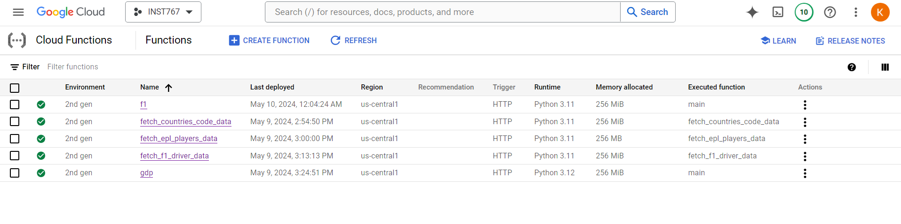

Below are all of our functioning Google Cloud Functions with a brief summary of
their API source and code:

1. [**Cloud_Functions/fl_data.py**](https://github.com/KamranDjourshari24/INST767_Project/blob/main/Cloud_Functions/f1_data.py): This code pulls data from Ergast API, which 
    contains information about all the Formula 1 Races. Our code pulls in all 
    the races starting from 2005 (the earliest the API allows for)  
    to the current year (using the Datatime Module), which allows for our code 
    to remain dynamic no matter what year it is. Once gathered, it sends all the
    data to the ***f1_race_info*** bucket.
    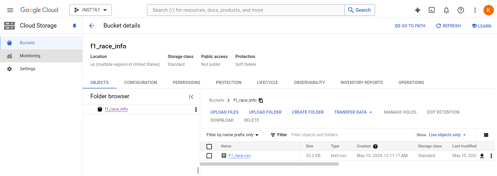

2. [**Cloud_Functions/fetch_countries_code_data.py**](https://github.com/KamranDjourshari24/INST767_Project/blob/main/Cloud_Functions/fetch_countries_code_data.py): Pulling data from the 
    SportsMonk API source, this returns all the Countries' information (id, name, 
    iso2, iso3 code). It stores the data in the ***countries_code_data*** 
    bucket.
    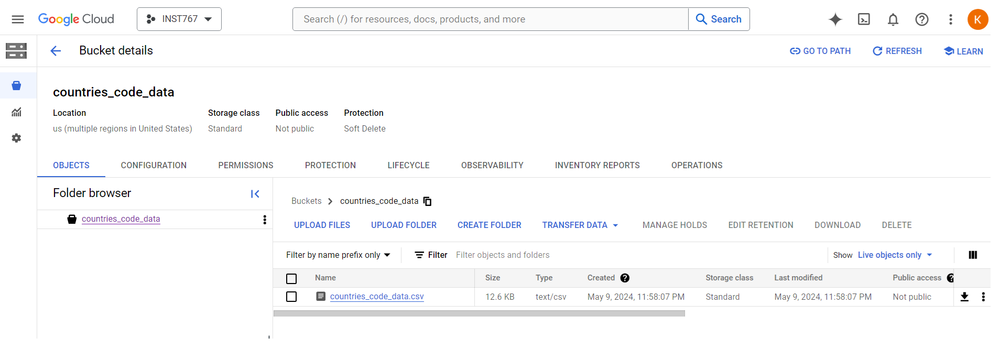

3. [**Cloud_Functions/fetch_epl_players_data.py**](https://github.com/KamranDjourshari24/INST767_Project/blob/main/Cloud_Functions/fetch_epl_players_data.py): This also pulls data from the 
    SportsMonk API source for English Premier League Players, including their 
    name, country of origin, and date of birth. The data is then stored in the 
    ***epl_players_data*** bucket.
    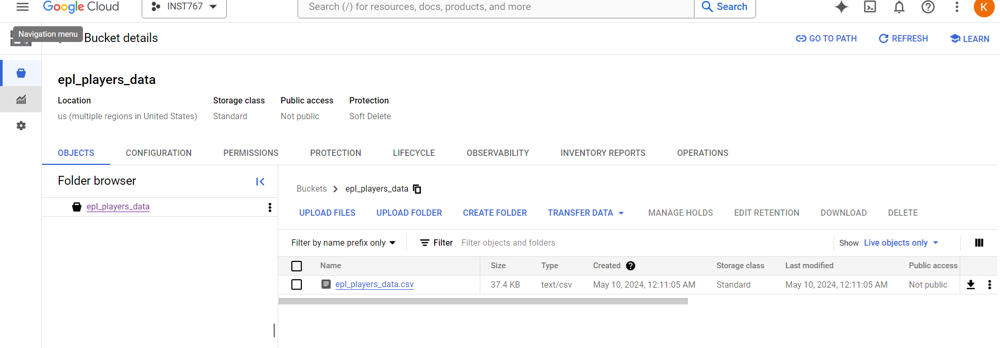   
    
4. [**Cloud_Functions/fetch_f1_drivers_data.py**](https://github.com/KamranDjourshari24/INST767_Project/blob/main/Cloud_Functions/fetch_f1_drivers_data.py): This retrieves data from the 
    SportsMonk API source for F1 Drivers in current races also, including their 
    name, country of origin, and date of birth. The data is then stored in the 
    ***f1_driver_data*** bucket.   
    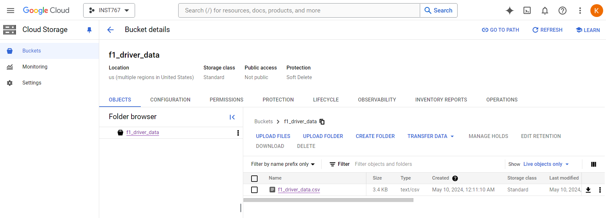

5. [**Cloud_Functions/get_gdp_data.py**](https://github.com/KamranDjourshari24/INST767_Project/blob/main/Cloud_Functions/get_gdp_data.py): Pulling data from the World Bank and 
    IMF APIs we are able to pull in all countries' GDP data (value and change 
    rate) starting from 1980 to the present time. NOTE: We had to pull from two 
    different APIs as the World Bank API doesn't return GDP data of all
    countries from one query/API call. Instead, we had to query each country with 
    the World Bank API and pull the necessary data. We were able to query  
    each country by using the IMFs API which returns all country names. The data 
    is then stored in the ***gdp_bank*** bucket.
    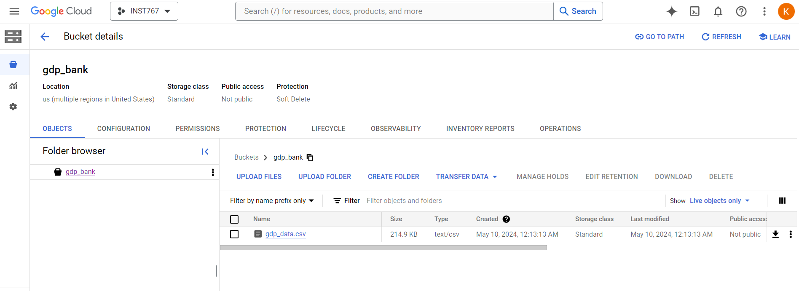 

From here, we set up individual Cloud schedulers for each of these Functions (excluding the country
function as that most likely won't ever have new data), which each has its set timeframes. 
Once these schedulers are run, they overwrite the existing .csv file in the given bucket with the 
new data in the same filename. Below shows evidence of the Schedulers working for each of the 
assigned Functions:

- **epl_call**: This scheduler is set to run the first of the month every September and February 
    at 12 AM UTC after the closing of the Transfer Window (where players are bought and sold to Premier 
    League Teams). 
      

    Bucket with new data (shown with Last modified Time):
    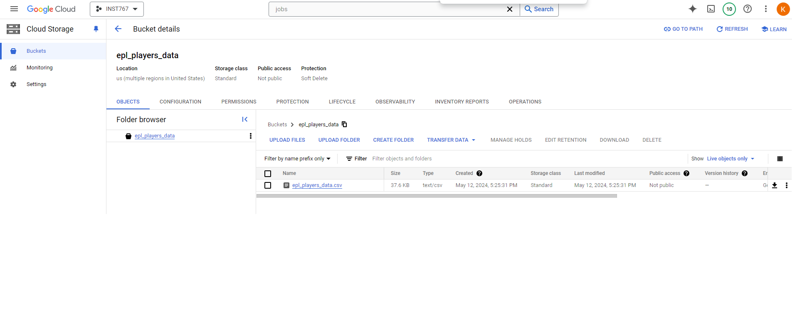  

- **f1_driver_call**: This scheduler is set to run before the start of every F1 Racing season at 
    12:20 AM UTC timezone on February 23rd with the new driver data. 
      

    Bucket with new data (shown with Last modified Time):
    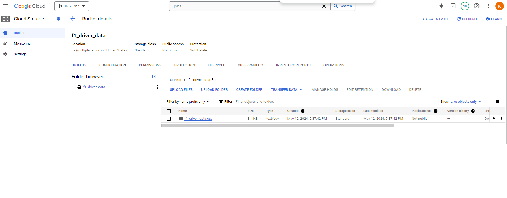

- **gdp_call**: This scheduler is set to run every 6 months starting from January. The goal
    is to gather new GDP data for the year within this time period as the release of new GDP data
    from the World Bank is somewhat unknown. 
      

    Bucket with new data (shown with Last modified Time):
    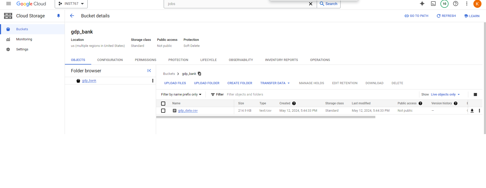

- **race_f1_call**: This scheduler is set to run yearly on February 2nd at 5:00 AM UTC Timezone. 
    The goal of this is to gather the new year's schedule which is always released sometime before 
    February (the starting month of the new F1 Season). As the new year schedule release data varies
    yearly, we chose the beginning of February just before the new season.  
      

    Bucket with new data (shown with Last modified Time):
    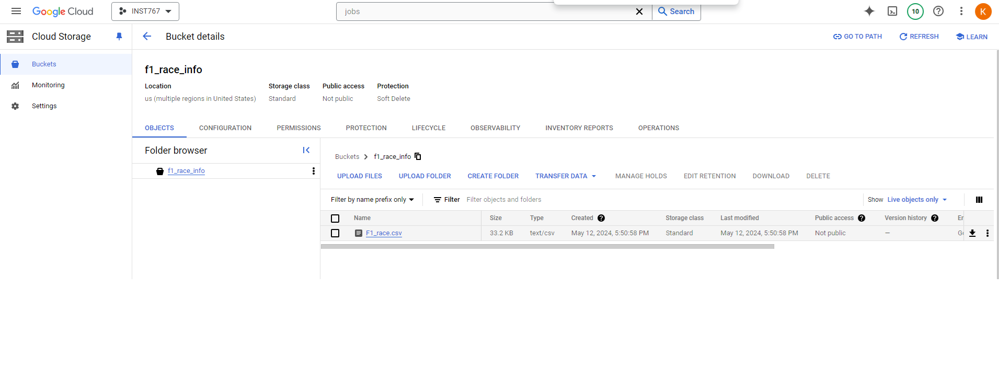

## Transformation
For the next step of the Pipeline, we created a controlled Dataproc Workflow which contains multiple jobs
of cleaning the various data using PySpark from the buckets and sending it as various tables to 
BigQuery. For this to work we designed a Workflow template that contains multiple different jobs of 
data cleaning, with no dependency on each other, which are explained here:

- **job-gdp-country**: The code used for this job is stored in [***cluster_job/gdp_country.py***](https://github.com/KamranDjourshari24/INST767_Project/blob/main/cluster_job/gdp_country.py). 
This job specifically only cleans the GDP and Country CSVs into one organized table. 
The tasks for this  job were to read in these two CSVs (from their given buckets mentioned above) and 
then merge them together into DataFrame. From there, we only selected the necessary columns and then 
assigned them to the correct Datatype before it was, lastly sent to BigQuery under the dataset 
*finalproject* under the table name gdp_country. 
Here is the Pyspark File stored in a bucket being used:  
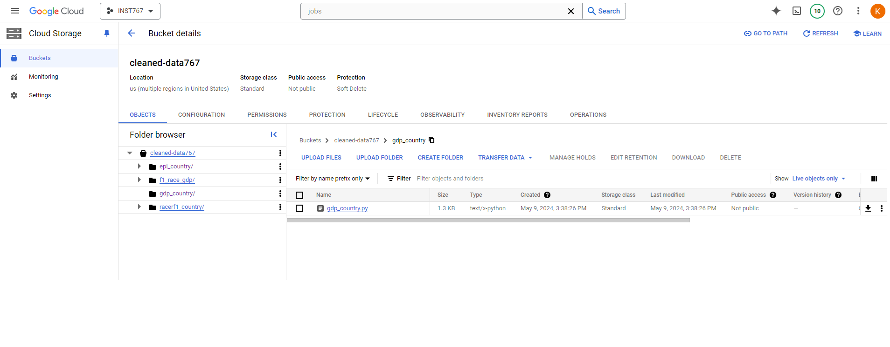

- **job-Racerf1-country**: The code used for this job is stored in [***cluster_job/f1_racer_country.py***](https://github.com/KamranDjourshari24/INST767_Project/blob/main/cluster_job/f1_racer_country.py).
This job specifically cleans up the Country CSV and F1 Driver Data into one cleaned dataset using 
Pyspark. After reading in these two dataframes, it adjusts some of the country codes for Countries 
where the ISO codes vary between these two dataframes and then joins them together using the 
Country code (from both F1 Race and country dataframe). The columns selected are adjusted and aliased
to their correct datatype and sent to BigQuery under the table name racerf1_country.
Here is the Pyspark File stored in a bucket being used:  
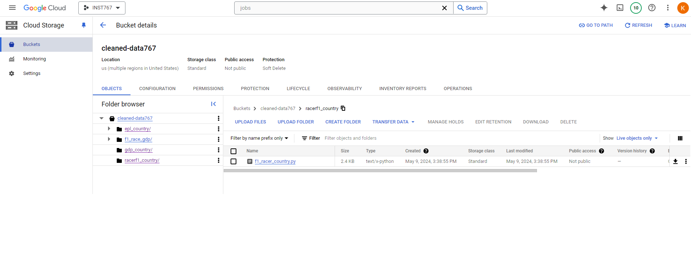

- **job-epl-country**: The code used for this job is stored in [***cluster_job/eplplayer_country.py***](https://github.com/KamranDjourshari24/INST767_Project/blob/main/cluster_job/eplplayer_country.py). 
This job calls on the EPL player CSV and Country CSV stored in their respective bucket. For this 
aspect, these two CSVs were read using Pyspark as DataFrames and joined together using Country ID.
From there data cleaning occurred with the renaming of the Name column to Country Name and the dropping
of NULL rows in the dataset. Also, standardization occurred with the new column formed for Birth Year being 
extracted from the Date of Birth. We then set the correct datatypes of the needed columns aliased 
them and then sent it to BigQuery under the table name epl_country. 
Here is the Pyspark File stored in a bucket being used:  
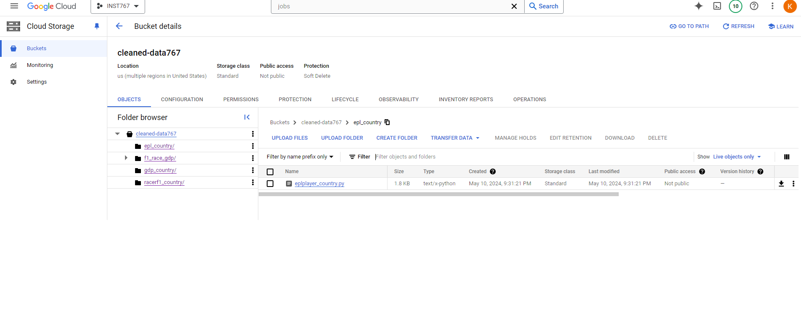

- **job-f1-race**: The code used for this job is stored in [***cluster_job/f1_race_gdp.py***](https://github.com/KamranDjourshari24/INST767_Project/blob/main/cluster_job/f1_race_gdp.py).
This last job reads in the F1 Race and GDP data from their stored buckets. The data cleaning occurs
using Pyspark where they are joined together using the Country Name from both datasets. As there 
were standardization issues between these two datasets in terms of Country Name, we renamed certain 
Country names to match beforehand in this as well (for example UAE was renamed to United Arab 
Emirates). The Time and Date were combined into one concatenated column as well. We then set the correct 
datatypes for the given columns and then wrote it to BigQuery under the table name f1_race.
Here is the Pyspark File stored in a bucket being used:  
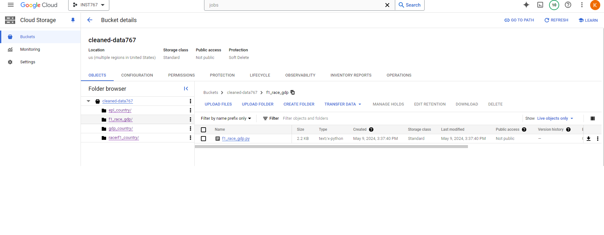

In order to automate this process, we set up a Cloud Scheduler which would call this Dataproc WorkFlow. 
We set it to run Weekly on Monday at 5 AM UTC Timezone. As shown here: 

Run Successfully:

Once triggered, it creates a temporary cluster, which executes these four jobs mentioned above, which can
be shown as run successfully here: 
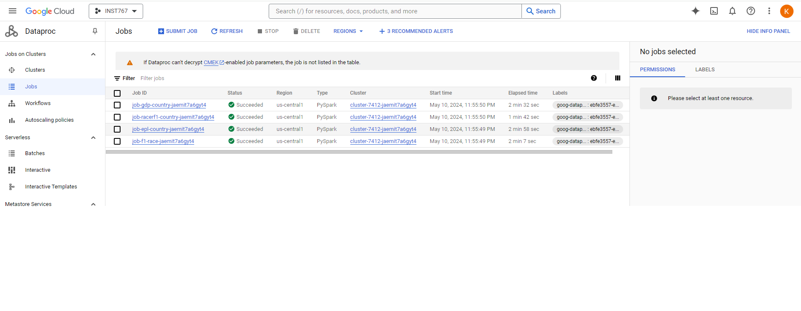

## Storage
For the storage aspect, we relied on BigQuery. As mentioned in the previous step, each of the 
Pyspark Jobs at the end of each program sent/wrote the DataFrames into BigQuery. From the project,
we created one dataset, named ***finalproject***, and stored all four tables within. We chose these
four unique entities as we viewed each as separate categories with unique information. From there, 
when conducting our analysis we could JOIN the tables together if needed. 

Here is a screenshot of all the tables stored within the dataset, which appeared once the 
DataProc Workflow, with various jobs, was officially completed. 

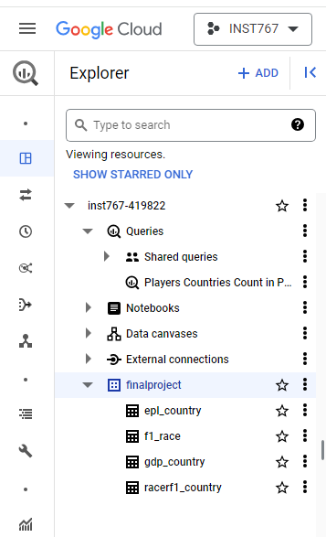

Preview of the **epl_country Table**:
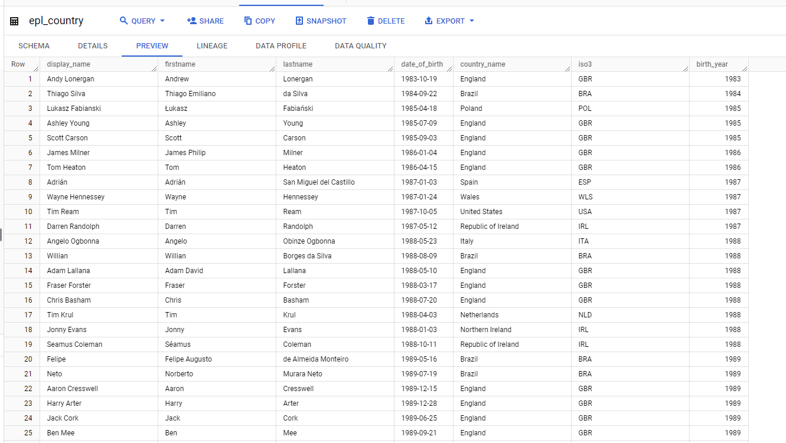

Preview of the **f1_race Table**:
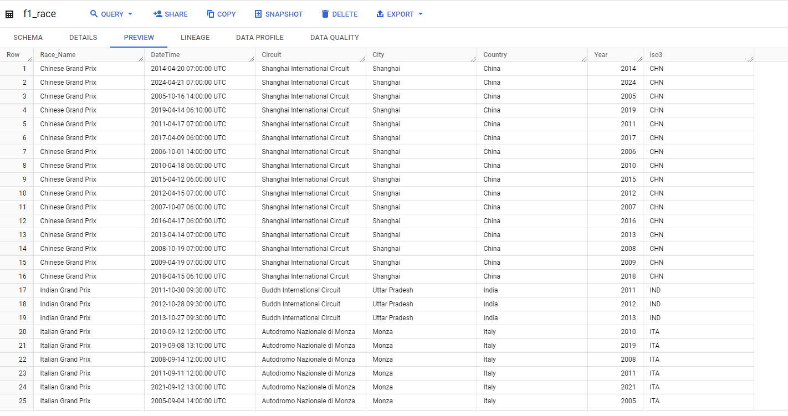

Preview of the **gdp_country Table**:
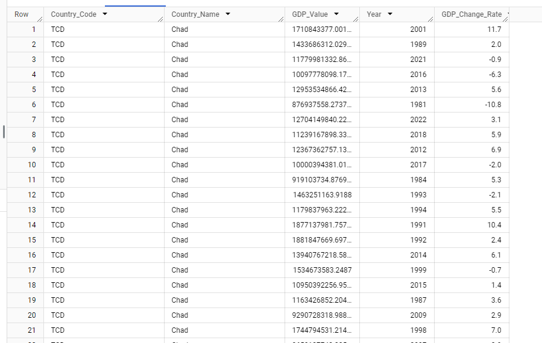

Preview of the **racerf1_country Table**:
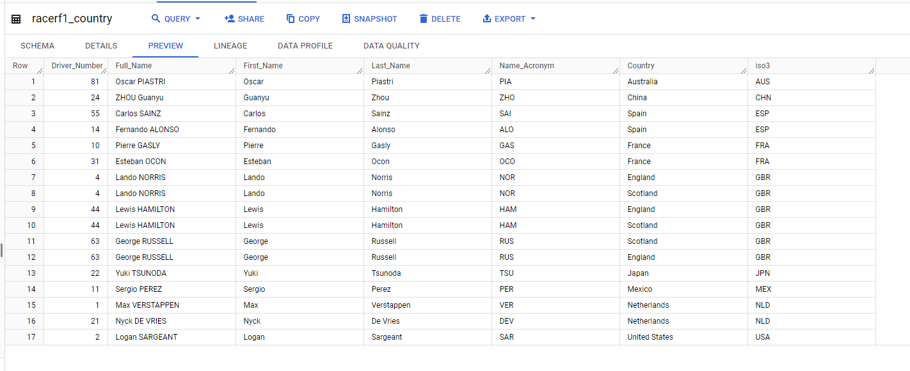

## Analysis
For the last aspect of the Data Pipeline, we analyzed the data to answer of variety of different 
questions that related to F1 Racing/EPL with GDP information. Below are the questions with sample 
screenshots of the answers to them

- **Which Countries are producing the most English Premier League talent and what are the respective countries'
average GDP?**
    
    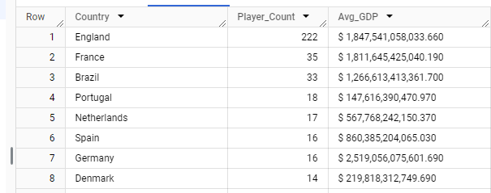

    The query to address this problem was from [**data_analysis/epl_countrycount_gdp.sql**](https://github.com/KamranDjourshari24/INST767_Project/blob/main/data_analysis/epl_countrycount_gdp.sql). 
    From the results we can see the top country by far is England, which makes sense as the League, 
    based in England, prioritizes English players. However, each of the top 3 nations all are worth
    over 1 Trillion dollars GDP-wise which highlights a potential pattern/correlation in terms of 
    Premier League Players and GDP value.

-  **On average, how many races are held each year for each circuit?** 

    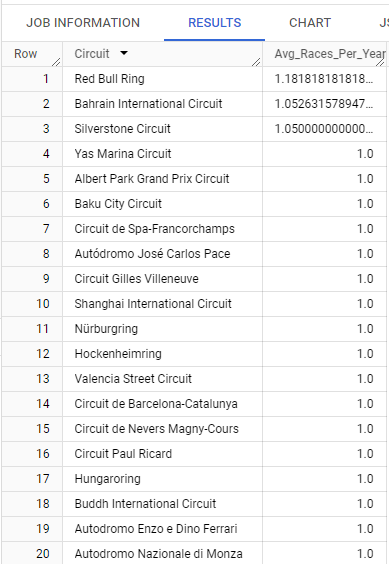

    This query, [**data_analysis/avg_races_per_year**](https://github.com/KamranDjourshari24/INST767_Project/tree/main/data_analysis) 
    calculates the number of races held each year for each circuit, then calculates the average 
    number of races per year across all years for each circuit. It provides insight into the 
    consistency of race schedules across different circuits. From the results, we can see that most 
    circuits hold one race a year, but there are a few that average more.

- **What are the top 5 countries in which the maximum no. of f1 races took place?**

    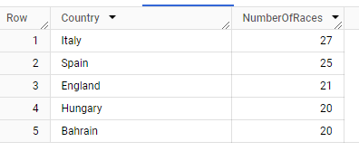

    This query, [**data_analysis/country_max_race**](https://github.com/KamranDjourshari24/INST767_Project/blob/main/data_analysis/country_max_race.sql)  
    displays the number of F1 races that took place in the five countries which hosted the most 
    amount of races. From the results, the countries Italy, Spain, England, Hungary and Bahrain 
    consisted of this top 5 respectively.

- **Which F1 racers have competed in races in their home countries?**

    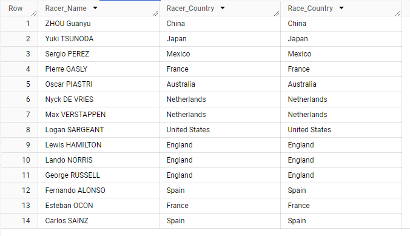

    The query to address this question was from [**data_analysis/f1_racers_racing_at_home.sql**](https://github.com/KamranDjourshari24/INST767_Project/blob/main/data_analysis/f1_racers_racing_at_home.sql). From the results, we can see that 14 drivers raced in their home country. Drivers from Australia, China, England, France, Japan, Mexico, Netherlands, Spain and the United States.

- **What is the average age for EPL players from each country that sends players to the league?**

    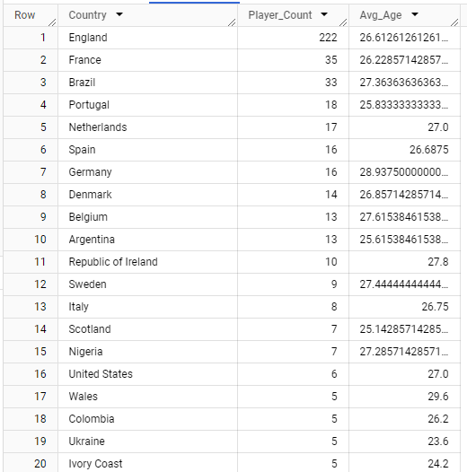

    The query to address this question was from [**data_analysis/player_avg_age.sql**](https://github.com/KamranDjourshari24/INST767_Project/blob/main/data_analysis/player_avg_age.sql). 
    From the results we can see that the average age for most of the countries by player count that 
    send players to the league is in the mid-to-late 20s. From the results, we can see that the two
    most popular nationalities in the Premier League were England and France. English Players
    are around 27 years old with 222 players in the Premier League and French Players have an average 
    age of 26 in the Premier League with 35 players in the league.

- **What names are most common among F1 racers and EPL players?**

    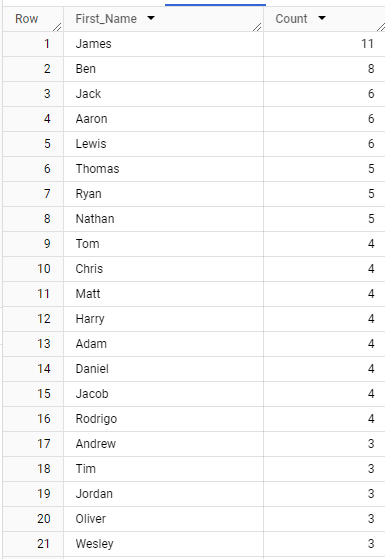

    This query, [**data_analysis/player_common_names.sql**](https://github.com/KamranDjourshari24/INST767_Project/blob/main/data_analysis/player_common_names.sql) 
    combines the first names of F1 racers and EPL players using UNION ALL. Then, it counts the 
    occurrences of each first name and retrieves the top 3 most common first names among them. 
    It provides an interesting insight into the distribution of names among athletes in these two 
    sports with James, Ben, and Jack being the most popular.

- **Find the correlation between no. of players and the average GDP of the country. Is there any positive/negative relationship?**

    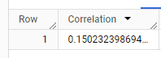

    The query, [**data_analysis/player_count_gdp.sql**](https://github.com/KamranDjourshari24/INST767_Project/blob/main/data_analysis/player_count_gdp.sql)
    correlation value based on output is +0.15, The positive sign indicates that as player count 
    tends to increase, average GDP also tends to increase slightly. The value of 0.15 suggests that 
    the relationship between player count and average GDP is quite weak. In practical terms, 
    this means that there isn't a strong connection between the number of players in a country and 
    its economic performance, as measured by GDP.

- **Populate country to-year matrix showing how many races happened in each country over the years.**

    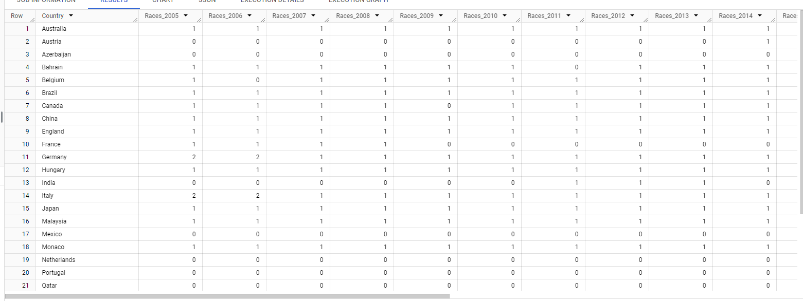

    The query to address this problem was from [**data_analyis/year_country_count.sql**](https://github.com/KamranDjourshari24/INST767_Project/blob/main/data_analysis/year_country_count.sql). 
    This table displays a matrix of race occurrences by country, showing the number of races held 
    over the years. In most years, only one race occurs per country, but there are exceptions when 
    two or three races take place in a single year in one country. For instance, in 2020, Italy 
    hosted three races.

